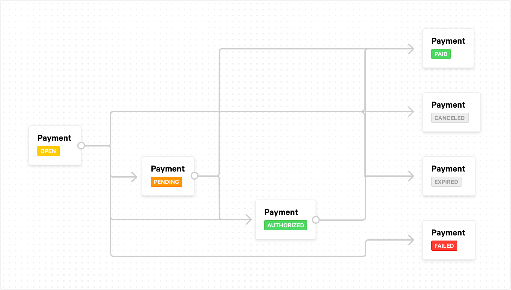
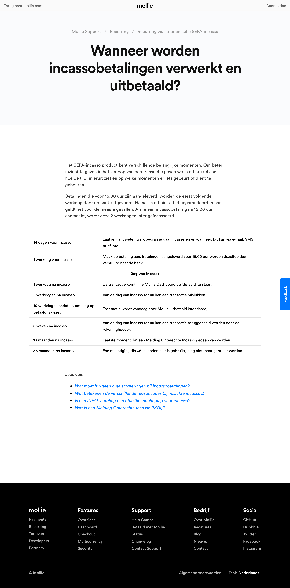

# Wanneer worden incassobetalingen verwerkt en uitbetaald?

Het SEPA-incasso product kent verschillende belangrijke momenten. Om beter inzicht te geven in het verloop van een transactie geven we in dit artikel aan hoe de tijdlijn eruit ziet en op welke momenten er iets gebeurt of dient te gebeuren.

Betalingen die voor 16:00 uur zijn aangeleverd, worden de eerst volgende werkdag door de bank uitgevoerd. Helaas is dit niet altijd gegarandeerd, maar geldt het voor de meeste gevallen. Als je een incassobetaling na 16:00 uur aanmaakt, wordt deze 2 werkdagen later geïncasseerd.

| Tijd                                                   | Beschrijving                                                                                            |
| ------------------------------------------------------ | ------------------------------------------------------------------------------------------------------- |
| **14** dagen voor incasso                              | Laat je klant weten welk bedrag je gaat incasseren en wanneer. Dit kan via e-mail, SMS, brief, etc.     |
| **1** werkdag voor incasso                             | Maak de betaling aan. Betalingen aangeleverd voor 16:00 uur worden dezelfde dag verstuurd naar de bank. |
| **Dag van incasso**                                                                                                                                              |
| **1** werkdag na incasso                               | De transactie komt in je Mollie Dashboard op 'Betaald' te staan.                                        |
| **5** werkdagen na incasso                             | Van de dag van incasso tot nu kan een transactie mislukken.                                             |
| **10** werkdagen nadat de betaling op betaald is gezet | Transactie wordt vandaag door Mollie uitbetaald (standaard).                                            |
| **8** weken na incasso                                 | Van de dag van incasso tot nu kan een transactie teruggehaald worden door de rekeninghouder.            |
| **13** maanden na incasso                              | Laatste moment dat een Melding Onterechte Incasso gedaan kan worden.                                    |
| **36** maanden na incasso                              | Een machtiging die 36 maanden niet is gebruikt, mag niet meer gebruikt worden.                          |

**Remco** from **Pronamic** to **Mollie** on **2 okt. 14:55 CEST**:

> Beste lezer,
> 
> Op de pagina https://help.mollie.com/hc/nl/articles/115000785649-Wanneer-worden-incassobetalingen-verwerkt-en-uitbetaald- staat dat incasso betalingen 1 werkdag na de dag van incasso op 'Betaald' komt te staan in het Mollie Dashboard. Zou de API dan ook de status betaald moeten terug geven voor de betreffende transacties? Wij zien namelijk dat de API vaak pas later de status betaald terug geeft. Ik kan mij ook niet herinneren dat dit eerder zo beschreven stond op de betreffende help pagina. Is de tekst op deze pagina misschien recent aangepast? Maar belangrijkste vraag: hoe werkt dit nu precies? We horen het graag, alvast bedankt.
> 
> Met vriendelijke groet,
> 
> Remco Tolsma
> Pronamic

**Martin** from **Mollie** to **Pronamic** on **4 okt. 13:00 CEST**:

> Beste meneer, mevrouw,
> 
> Bedankt voor uw bericht.
> 
> Dat klopt, als alles loopt zoals geplant dan verwerkt de bank de incasso de eerstvolgende werkdag en krijgt de betaling de status "Betaald". Het komt echter vaak voor dat de banken de betaling pas later verwerken, vandaar dat u merkt dat de transactie pas later op "betaald" komt.
> 
> Wij roepen in ieder geval altijd uw webhook aan als de status veranderd, dus u kunt het beste wachten daarop.
> 
> Mocht u nog vragen hebben, neem dan gerust contact met ons op of raadpleeg ons helpcenter voor meer informatie.
> 
> Met vriendelijke groet,
> Martin

**Remco** from **Pronamic** to **Mollie** on **7 okt. 13:43 CEST**:

> Hoi Martin,
> 
> Bedankt voor je reactie. Zou je dan de betreffende help pagina willen aanpassen/verduidelijken? Wat je nu aangeeft lijkt namelijk een beetje tegenstrijdig met wat er op de betreffende help pagina staat.
> 
> > Betalingen die voor 16:00 uur zijn aangeleverd, worden de eerst volgende werkdag door de bank uitgevoerd. Helaas is dit niet altijd gegarandeerd, maar **geldt het voor de meeste gevallen**.
> 
> Terwijl je nu het volgende aangeeft:
> 
> > **Het komt echter vaak voor dat de banken de betaling pas later verwerken**, vandaar dat u merkt dat de transactie pas later op "betaald" komt.
> 
> In de praktijk zien wij ook dat het regelmatig later is, dus niet in de meeste gevallen de eerst volgende werkdag.
> 
> Ook vinden we het regeltje "1 werkdag na incasso | De transactie komt in je Mollie Dashboard op 'Betaald' te staan." in de tabel op de help pagina niet heel duidelijk. Het suggereert alsof de betaling altijd de status 'Betaald' krijgt op 1 werkdag na incasso, maar dat is dus blijkbaar niet het geval.
> 
> Wij raadplegen de betreffende pagina wel regelmatig tijdens het ontwikkelen van onze plugin. Het is bij toekomstige ontwikkelingen wel fijn als het daarom duidelijk staat beschreven. Nu vragen we ons namelijk regelmatig af hoe het ook alweer zat. Doordat praktijk en documentatie niet goed aansluiten is het verwarrend. Misschien kan het gecombineerd worden met de volgende pagina: https://docs.mollie.com/payments/status-changes. En misschien met een flow diagram a la https://assets.docs.mollie.com/_images/payment-status-flow@2x.png het incasso traject verduidelijken? We horen het graag.
> 
> Met vriendelijke groet,
> 
> Remco Tolsma

**Martin** from **Mollie** to **Pronamic** on **7 okt. 13:50 CEST**:

> Beste meneer, mevrouw,
> 
> Bedankt voor uw reactie en feedback.
> 
> Ik zal uw suggesties doorspelen naar onze development afdeling. Een flow chart zou inderdaad mooi zijn om het allemaal net wat inzichtelijker te maken!
> 
> Mocht u nog vragen hebben, neem dan gerust contact met ons op of raadpleeg ons helpcenter voor meer informatie.
> 
> Met vriendelijke groet,
> Martin

